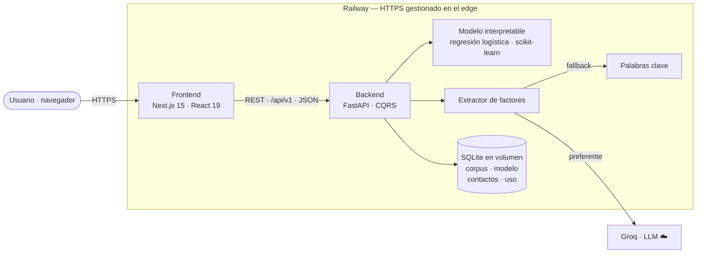
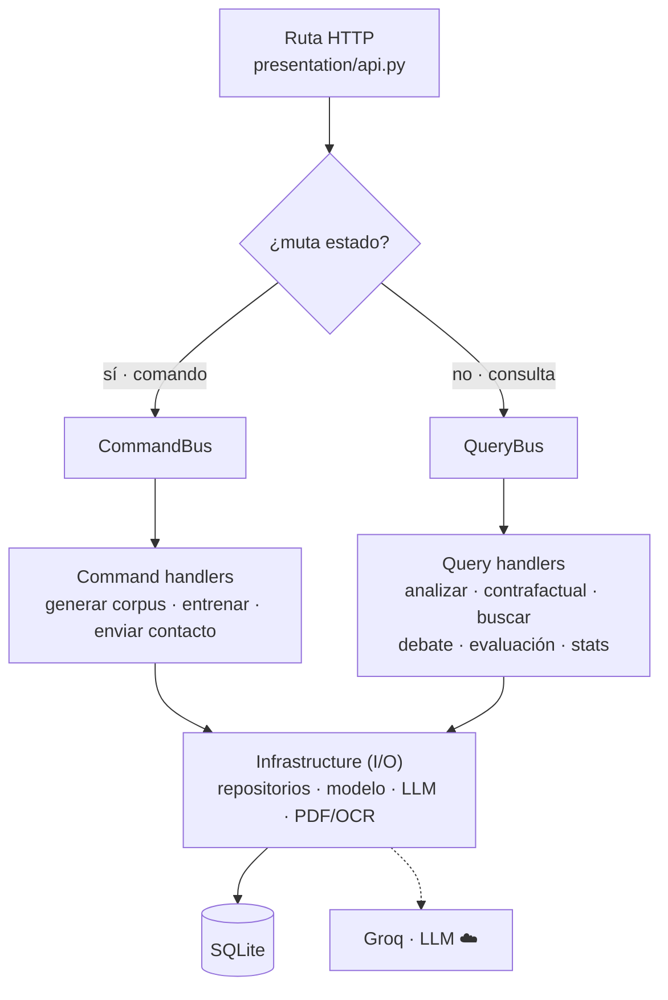
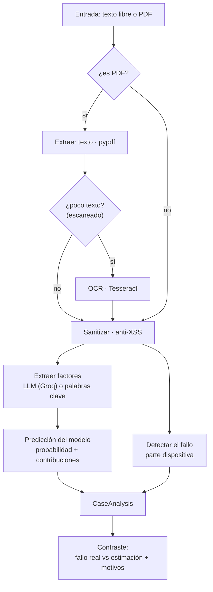
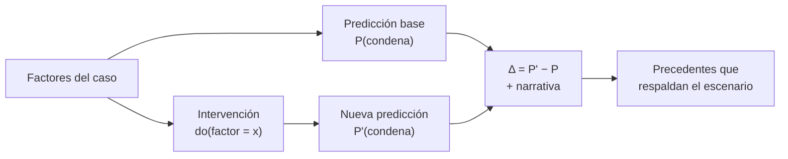
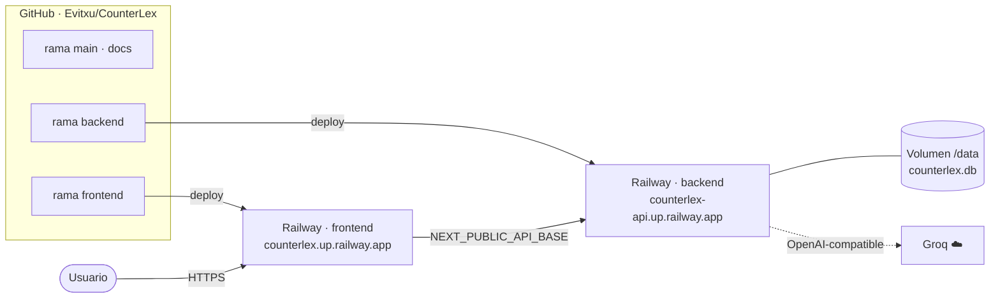

# CounterLex — Arquitectura y flujos

Diagramas (Mermaid) del sistema. Se renderizan automáticamente en GitHub y
pueden exportarse a PNG/SVG para la memoria o las diapositivas.

---

## 1. Arquitectura del sistema

Frontend y backend desacoplados; el backend usa un modelo interpretable en
proceso, SQLite en un volumen persistente y un LLM externo (Groq) con *fallback*
por palabras clave.

---

## 2. Backend — Clean Architecture + CQRS

Regla de dependencias: las **rutas** solo tocan un *bus*; los **comandos** mutan
estado y las **consultas** son de solo lectura. La infraestructura es la única
capa que hace I/O.

---

## 3. Pipeline de «Analizar sentencia»

Texto libre o PDF (con OCR para escaneados) → factores → predicción, y en
paralelo se detecta el **fallo** real para contrastarlo con la estimación.

---

## 4. Mecanismo contrafactual

El coeficiente de cada factor *es* su efecto (log-odds), por lo que un
contrafactual es una intervención limpia: fijar un factor y recomputar.

---

## 5. Topología de despliegue (Railway)

Una repo con **una rama por componente**; cada servicio de Railway sigue su rama.
El backend monta un volumen persistente y usa Groq; el frontend hornea la URL de
la API en tiempo de build.

